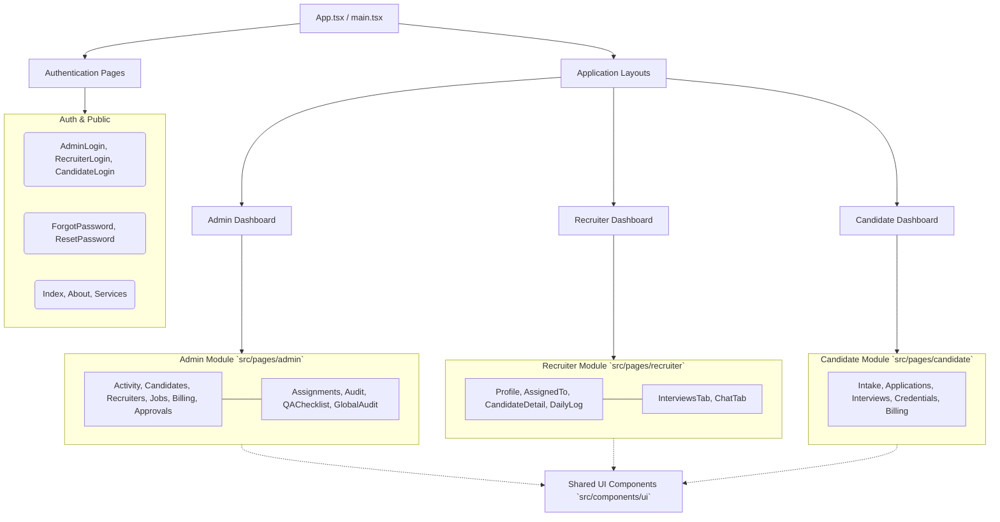
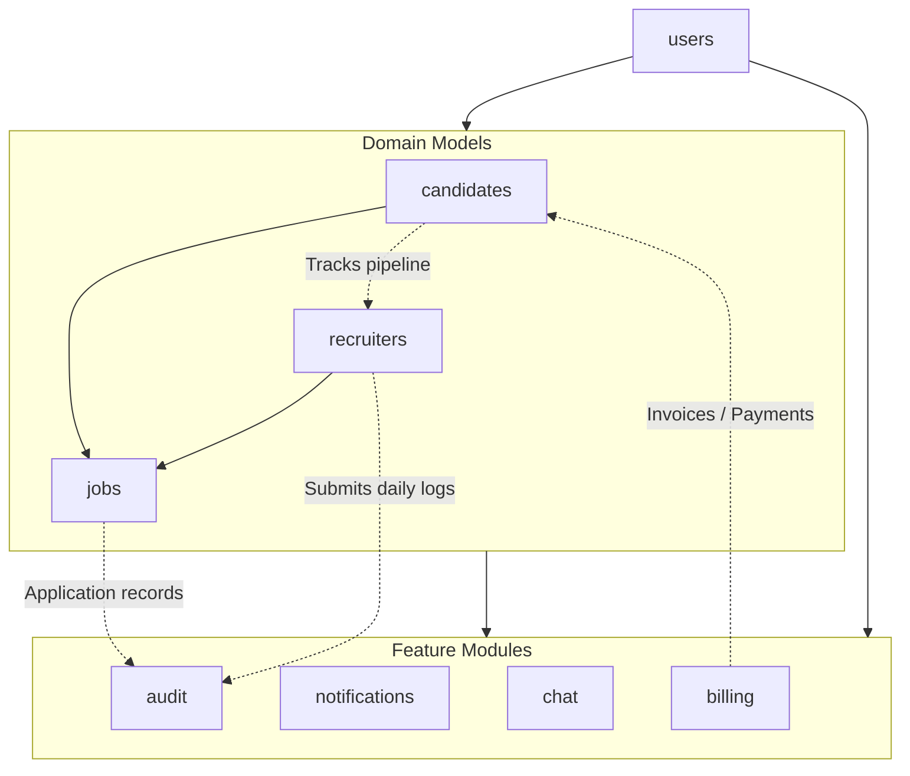
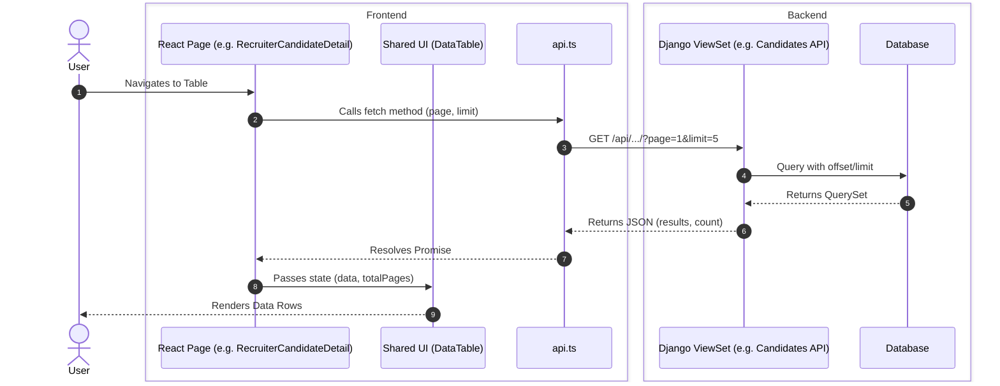

# Hyrind Codebase Architecture & Dependency Map

This document provides a structural overview of the Hyrind application, documenting the interdependencies between the frontend UI layers, the API integration services, and the backend Django modules. This map serves as a guide for future development, refactoring, and maintaining architectural consistency across the application.

## 1. System High-Level Architecture

The platform operates on a decoupled architecture where the React frontend communicates via a centralized API service (`api.ts`) to the Django REST framework backend.

```mermaid
flowchart TB
    %% High Level Architecture
    subgraph Frontend [Frontend (React + Vite + Tailwind)]
        UI[User Interface Components]
        Pages[Page Routing Layer]
        APIClient[API Service `api.ts`]
        
        UI --> Pages
        Pages --> APIClient
    end

    subgraph Backend [Backend (Django + DRF)]
        Router[URL Routers]
        Views[Views / ViewSets]
        Models[Django Models]
        DB[(SQLite Database)]
        
        Router --> Views
        Views --> Models
        Models --> DB
    end
    
    APIClient <-->|REST / JSON| Router
```

## 2. Frontend Application Flow

The React frontend is divided into three primary functional domains (Admin, Recruiter, and Candidate) with shared UI and layout components. Navigation is handled primarily at the root, directing to domain-specific dashboards.



## 3. Backend Django App Interdependencies

The Django backend is modularized into feature-specific apps. The `users` app serves as the core foundation, extending Django's built-in User model and providing authentication for candidates, recruiters, and admins.



## 4. Feature Vertical Slice (Example: Data Table Pagination & Tracking)

When a user interacts with a feature (like viewing a candidate's details or paginated data), the execution path flows predictably through the layers.



## Summary of Architectural Patterns

1. **Centralized API Management:** All API requests on the frontend are routed through `src/services/api.ts`. This file handles token injection, error handling, and endpoint resolution.
2. **Domain-Driven Directory Structure:** The frontend pages are strictly segregated by role (`admin/`, `recruiter/`, `candidate/`) which maps cleanly to the expected user experience and permissions model.
3. **Reusable Data Components:** UI components (like tables, paginations, modals) are abstracted into `src/components/ui` to be consumed by the specific page modules, maintaining consistent aesthetics and behavior (e.g., standard page size of 5 for DataTables).
4. **Backend Modularity:** Distinct Django apps (`audit`, `billing`, `chat`, etc.) keep database models and business logic isolated, allowing for targeted updates without system-wide regressions.
