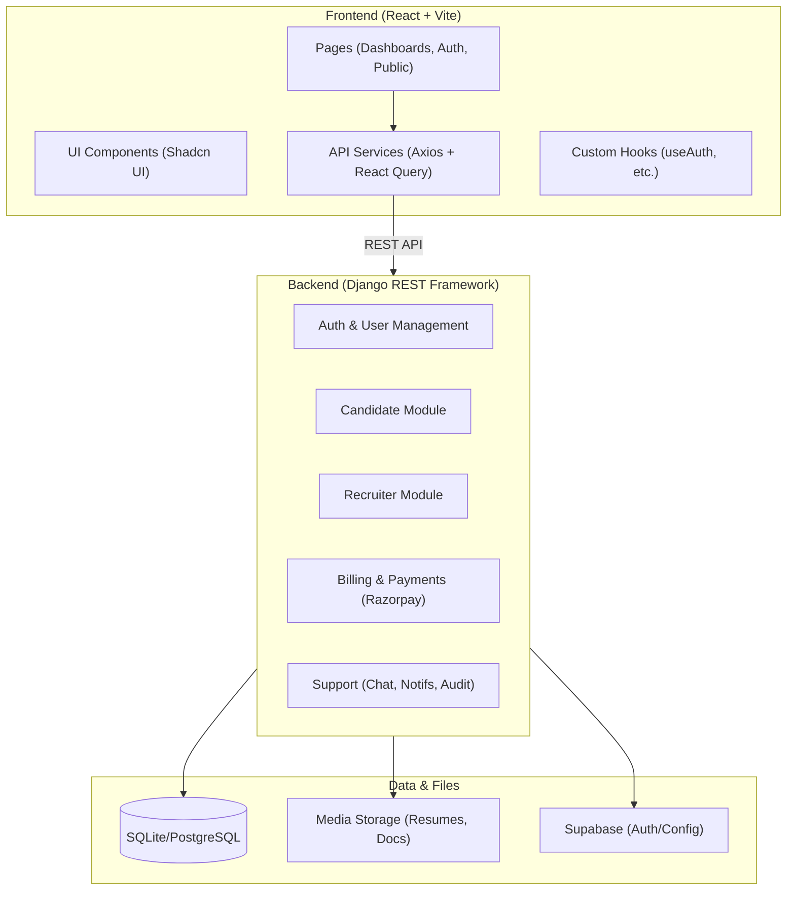
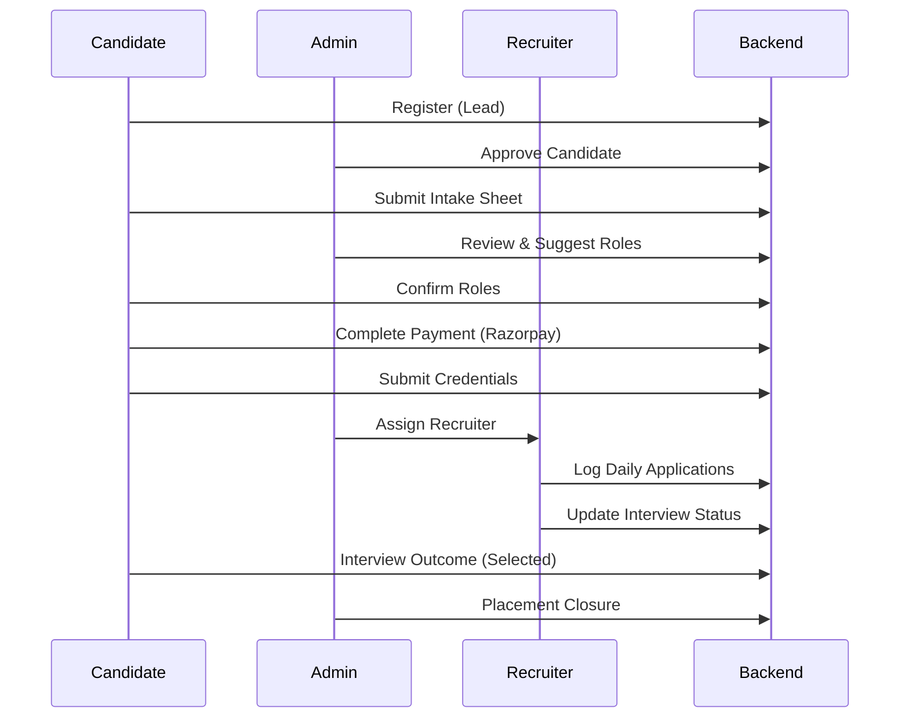

# Hyrind System Architecture & Codebase Map

## 🏗️ High-Level System Architecture

---

## 📂 Codebase Structure

### 🌐 Frontend (`/src`)
*   **`pages/`**: core views categorized by role.
    *   `CandidateDashboard.tsx`, `RecruiterDashboard.tsx`, `AdminDashboard.tsx`.
    *   Sub-pages for intake, roles, credentials, billing, etc.
*   **`components/`**:
    *   `ui/`: Atomic design components (buttons, cards, inputs via Shadcn).
    *   `dashboard/`: Layouts, sidebars, and role-specific widgets.
*   **`services/`**:
    *   `api.ts`: Centralized Axios instance with interceptors for JWT and error handling.
*   **`hooks/`**: Business logic extraction (e.g., `useAuth`).

### ⚙️ Backend (`/django_backend`)
*   **`users/`**: Custom `User` model, per-role display IDs (HYRCDT, HYRREC), and JWT auth.
*   **`candidates/`**: 
    *   `Candidate` model: Status-driven lifecycle (Lead → Approved → Active → Placed).
    *   `ClientIntake`, `InterviewLog`, `PlacementClosure`.
*   **`recruiters/`**:
    *   `RecruiterProfile`, `RecruiterAssignment` (links recruiter to candidate).
    *   `DailySubmissionLog`, `JobLinkEntry` (tracking recruiter activity).
*   **`billing/`**: Subscription plans, addons, and Razorpay integration.
*   **`hyrind/`**: Core settings, URL routing, and media serving logic.

---

## 🔄 Core Data Flow: Candidate Lifecycle

---

## 🛠️ Tech Stack Details

| Layer | Technologies |
| :--- | :--- |
| **Frontend** | React 18, Vite, TypeScript, Tailwind CSS, Framer Motion |
| **State/Data** | TanStack Query (React Query), Axios |
| **Icons/UI** | Lucide React, Radix UI, Shadcn UI |
| **Backend** | Python 3.11+, Django 4.2+, Django REST Framework |
| **Security** | SimpleJWT (OAuth2), Role-Based Access Control (RBAC) |
| **Payments** | Razorpay SDK Integration |
| **Documentation** | DRF Spectacular (OpenAPI 3.0), Swagger UI |

---

## 🔑 Key Relationships

*   **User ↔ Role**: Every `User` has one `role` which dictates dashboard access and API permissions.
*   **Candidate ↔ Recruiter**: Linked via `RecruiterAssignment`. A candidate can have multiple recruiters (e.g., for different roles).
*   **Submission ↔ Job**: `JobLinkEntry` tracks specific applications made for a `Candidate` by a `Recruiter`.
*   **Billing ↔ Subscription**: `Candidate` is linked to a `Subscription` which contains `Plans` and `Addons`.

> [!NOTE]
> This map is dynamically generated based on the current codebase state as of May 20, 2026. (Nodes: 992, Connections: 2421, Communities: 40)
