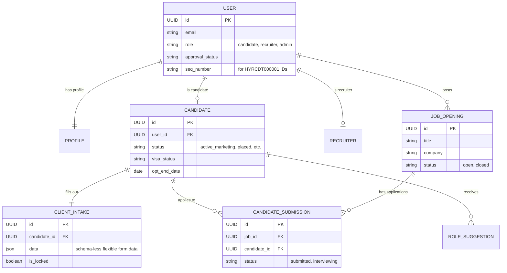
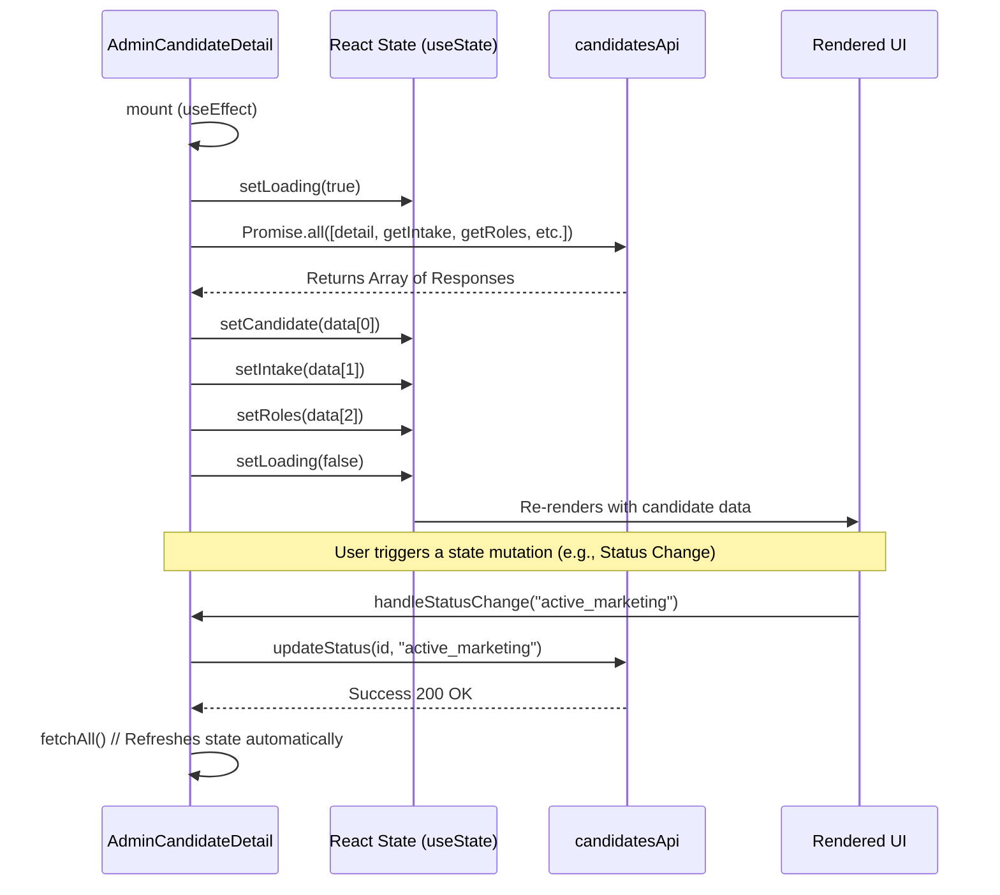

# Hyrind Low-Level Architecture (React + Django + DB)

This document provides a detailed, low-level technical breakdown of the Hyrind platform, illustrating how the React frontend interacts with the Django REST API, and how the core database schema is structured.

## 1. Database Schema Overview (Django Models)

The backend uses a relational database (SQLite in development, typically PostgreSQL in production). The models are heavily normalized around a custom `User` model, using One-to-One relationships for domain-specific profiles.

### Core Entity Relationship Diagram



### Key DB Patterns:
- **UUID Primary Keys:** All major tables use `uuid.uuid4` as `primary_key=True` for security and decoupled generation.
- **JSON Fields for Flexibility:** Extensive use of `models.JSONField` (e.g., `ClientIntake.data`, `CredentialVersion.data`, `JobOpening.required_skills`). This allows form fields to evolve without constant database migrations.
- **Branded IDs:** The `seq_number` field coupled with properties like `User.display_id` auto-generates branded strings like `HYRCDT000015` or `HYRREC000002` dynamically, driven by role-specific maximum counters.

---

## 2. API Integration Layer (React to Django)

The React frontend communicates with Django exclusively via a centralized Axios instance located in `src/services/api.ts`.

### Axios Interceptor & Authentication Flow
- **Token Management:** JWTs (`access_token`, `refresh_token`) are stored in `localStorage`.
- **Request Interceptor:** Injects `Authorization: Bearer <token>` into every request automatically.
- **Response Interceptor:** 
  - Catches `401 Unauthorized`. If the access token expires, it automatically halts the request, hits `/auth/refresh/` using the refresh token, updates `localStorage`, and retries the original request.
  - Catches `404` (for GET requests) and redirects to `/404`.
  - Catches `500+` and redirects to `/500` server error page.

### API Dictionaries
Instead of raw `fetch` calls in components, endpoints are grouped by domain objects:
```typescript
export const candidatesApi = {
  detail: (id: string) => api.get(`/candidates/${id}/`),
  updateStatus: (id: string, status: string) => api.post(`/candidates/${id}/status/`, { status }),
  // ...
};
```

---

## 3. React Component Architecture (State & Lifecycle)

Let's look at how a complex "Smart Component" like `AdminCandidateDetail.tsx` binds the API to the UI.

### Component Data Flow Sequence



### Key Frontend Patterns:
- **Parallel Fetching:** `Promise.all()` is used in `fetchAll()` to minimize waterfall loading when a page requires multiple resources (e.g., Intake, Roles, Credentials, Payments).
- **Graceful Degradation with `.catch()`:** 
  `candidatesApi.getIntake().catch(() => ({ data: null }))`
  If a child resource 404s (e.g., candidate hasn't filled out intake), it returns null rather than breaking the `Promise.all` chain.
- **Shadcn UI Composability:** The UI relies heavily on composition (e.g., `<Card><CardHeader>...</CardHeader></Card>`) instead of massive monolithic props, giving fine-grained control over layout styling.

---

## 4. End-to-End Operation Example: "Adding a Role Suggestion"

1. **User Action:** Admin types a role title and clicks "Suggest Role" in React.
2. **React Logic:** `handleAddRole` validates input, sets `addingRole(true)` (spins a loader).
3. **API Call:** Calls `candidatesApi.addRole(id, payload)` → Axios POST to `/api/candidates/<uuid>/roles/add/`.
4. **Django Routing:** `urls.py` maps to `CandidateViewSet.add_role` via `@action(detail=True, methods=['post'])`.
5. **Django Logic:** The view extracts `role_title`, fetches the `Candidate` instance, validates permissions, and runs `RoleSuggestion.objects.create(...)`.
6. **DB Transaction:** Inserts a row into `role_suggestions` table.
7. **Response:** Returns `201 Created` JSON.
8. **React Update:** React catches the success, fires `toast({ title: "Success" })`, and calls `fetchAll()` to pull down the newly inserted role and re-render the Data Table.
